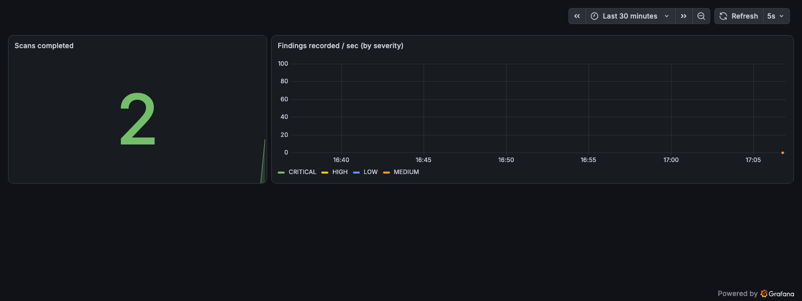
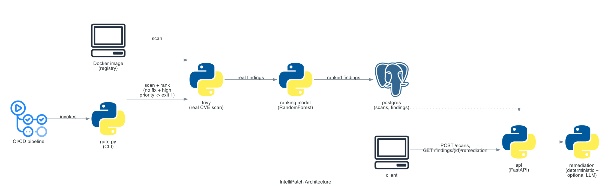

# IntelliPatch

[](https://github.com/kartik117/intellipatch/actions/workflows/ci.yml)

Automated CVE scanning and prioritization for container images. Trivy scans a real image; a RandomForest model ranks the findings by exploitability rather than raw CVSS score; remediation reports get drafted automatically; a CI/CD gate blocks the pipeline on unresolved high-priority findings.



## The exploitability ranking is the point

Two CVEs can share the same CVSS score and pose very different real-world risk — one exploitable over the network with no authentication, the other requiring local shell access. Raw CVSS can't tell them apart; this project ranks by parsing the actual CVSS v3 vector string Trivy reports (`AV:N/AC:L/PR:N/UI:N/...`) into real sub-metrics and feeding them to a trained model alongside the base score.

The original plan was to blend in [EPSS](https://www.first.org/epss/) (a real exploit-probability score). The public API turned out to be down/access-restricted when I went to integrate it — `api.first.org/data/v4/epss` returns `"Not found or permanently disabled"` even for an unfiltered query. Used the CVSS vector sub-metrics instead: no external API dependency, and Trivy was already returning the data.

## How it works



`api` is the one long-running service (`POST /scans`, `GET /scans/{id}/findings`, `GET /findings/{id}/remediation`). `gate.py` is a CLI, not a service — a CI/CD gate is a single pipeline step, invoked once per build, not something with its own lifecycle.

**Training data is real.** 1,142 findings from `trivy image` scans of 5 real public images (`python:3.9-slim`, `node:14-slim`, `nginx:1.18`, `redis:6.0`, `ubuntu:20.04` — intentionally dated, to guarantee real CVEs), checked into [`data/raw_trivy_scans/`](data/raw_trivy_scans/). Every CVE ID, package, version, and CVSS vector in the training set is real. Only the training *label* is a documented heuristic (60% CVSS score, 40% exploitability sub-metrics — see [`ranking/label.py`](src/intellipatch/ranking/label.py)), since no dataset of "this CVE was actually exploited" exists to train against.

The model's R² against that heuristic is 0.9996 — high because it's reconstructing a transparent formula, not discovering hidden signal. The feature importances confirm it: `cvss_score` and `is_network_exploitable` dominate (0.47 / 0.51 combined); `severity_rank` and `has_fix` — included as features but deliberately *not* part of the label formula — contribute ~0.001 combined. The model correctly learned to ignore the two inputs that shouldn't matter, which is a real (if modest) sanity check on the pipeline.

## Stack

Python 3.11 · Trivy · scikit-learn (RandomForest) · FastAPI · SQLAlchemy + Postgres · langchain-google-genai (optional) · Prometheus + Grafana · pytest · Docker Compose

## Running it

```bash
docker compose up -d --build

curl -X POST http://localhost:8001/scans -H "Content-Type: application/json" \
  -d '{"image":"node:14-slim"}'
# {"scan_id": "...", "image": "node:14-slim", "finding_count": 135}

curl http://localhost:8001/scans/<scan_id>/findings   # ranked, highest priority first
curl http://localhost:8001/findings/<finding_id>/remediation
```

**The CI/CD gate**, meant to run as a pipeline step rather than a container:

```bash
pip install -e .
python -m intellipatch.gate node:14-slim --threshold 70
# prints the top 10 findings by priority, then exits 1 if any finding with
# no fix available is at or above the threshold -- exit 0 otherwise
```

**Local development:**

```bash
python3.11 -m venv .venv && source .venv/bin/activate
pip install -e ".[dev]"
pytest        # 36 tests -- no Trivy, Postgres, or network required
ruff check .
```

**Retraining the model** (needs Trivy installed locally, or just use the committed `data/raw_trivy_scans/`):

```bash
python -m intellipatch.ranking.train
```

## Engineering notes

**Why a CLI for the gate, not a service.** A CI/CD gate runs once per build and exits — modeling it as a long-running container would mean every pipeline either keeps a container warm for no reason or pays a cold-start cost on every run. `gate.py`'s `evaluate()` is split from `main()` specifically so the blocking logic is unit-testable without going through `argparse`/`sys.exit`.

**Why a fix being available doesn't block the gate.** A CVE with a published fix is "upgrade the package" — a normal dependency bump, not a deploy blocker. A high-priority CVE with *no* fix available is the one that actually needs a human decision (ship anyway with a compensating control, hold the deploy, or remove the package) before going out the door.

**Known simplifications:** the priority label is a transparent heuristic, not learned from real exploit outcomes — explicit above and in the code, not buried in a docstring. The LLM remediation step has no retry beyond the try/except in `report.py`; a slow or failed call just means a plainer message, not a failed request. Trivy's vulnerability DB is baked into the Docker image at build time rather than refreshed on container start, which means a deployed container's CVE data is only as fresh as its last build — fine for a demo, not for a production deployment, which would want a separate scheduled DB refresh.
